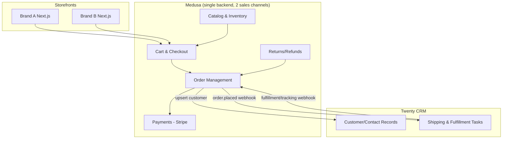

# Process Landscape — Medusa + Twenty CRM

This maps every end-to-end process the system needs to support, independent of which spec
or phase implements it. Use this as the index that the specs and TDD tests trace back to.

## Landscape overview

---

## 1. Order-to-Cash

**Trigger:** Customer completes checkout on either storefront.

1. Customer browses catalog (shared inventory pool, brand-specific product set)
2. Cart built, currency fixed by store/domain
3. Stripe payment authorized and captured
4. Order created in Medusa, tagged to the originating sales channel
5. Inventory reserved/decremented from the shared pool
6. Order confirmation sent to customer

**Systems:** Storefront (Brand A or B) → Medusa (Catalog, Cart, Payments, Orders) → Stripe
**Output:** Confirmed Medusa order, decremented shared stock

---

## 2. Shared Inventory Management

**Trigger:** Any sale, restock, or manual adjustment on either brand.

1. Stock levels held once, in a shared inventory location
2. Sale on Brand A reserves/decrements stock
3. Brand B's product page (if selling the same variant) reflects the new level immediately
4. Low-stock/out-of-stock thresholds trigger Admin alerts

**Systems:** Medusa Inventory module, both storefronts
**Output:** Single source of truth for stock across brands

---

## 3. Shipping & Fulfillment (Twenty-owned)

**Trigger:** `order.placed` event in Medusa.

1. Medusa fires webhook with order + customer payload
2. Twenty creates a shipping task and upserts the unified customer contact
3. Staff processes the shipment in Twenty: sets address, method, cost, creates shipment
4. Staff enters tracking number, marks fulfilled
5. Twenty fires webhook back to Medusa with fulfillment status + tracking
6. Medusa updates the order's fulfillment record (order status/payment untouched)

**Systems:** Medusa → webhook → Twenty → webhook → Medusa
**Output:** Order marked fulfilled with tracking, visible in Medusa Admin

---

## 4. Customer Identity & CRM Sync

**Trigger:** New customer signup, or first order from either brand.

1. Customer account is shared across both storefronts (single login)
2. On order placement, Medusa upserts a Twenty Person by email
3. All orders from both brands attach to that one Person record
4. Twenty holds full purchase history across brands for support/marketing

**Systems:** Medusa Customer module ↔ Twenty CRM
**Output:** One CRM contact per human, spanning both brands

---

## 5. Returns & Refunds

**Trigger:** Customer or staff initiates a return.

1. Return requested against an existing order
2. Staff approves, return shipping arranged (via Twenty, same as outbound)
3. Item received, inventory restocked to the shared pool
4. Refund issued via Stripe
5. Order and CRM record updated

**Systems:** Medusa Returns module, Twenty (return shipping), Stripe
**Output:** Refunded order, restocked inventory, updated CRM history

---

## 6. Sync Resilience (Twenty unavailable)

**Trigger:** Any Medusa → Twenty webhook fails to deliver.

1. Medusa order/customer operation completes normally — never blocked by Twenty's uptime
2. Failed webhook event is queued (Redis-backed)
3. Retry with backoff until Twenty acknowledges
4. Idempotency key prevents duplicate task/contact creation once Twenty recovers
5. Alert raised if an event exceeds max retry attempts (needs manual reconciliation)

**Systems:** Medusa event bus, Redis queue, Twenty
**Output:** Eventually-consistent sync with no lost sales and no duplicate CRM records

---

## Cross-reference

| Process | Primary spec | TDD spec |
|---|---|---|
| 1. Order-to-Cash | 04-payments.md, 02-catalog-inventory.md | medusa-checkout-payments.tdd.md |
| 2. Shared Inventory | 02-catalog-inventory.md | medusa-catalog.tdd.md |
| 3. Shipping & Fulfillment | 09-shipping-workflow.md, 08-integration-webhooks.md | shipping-workflow.e2e.tdd.md |
| 4. Customer & CRM Sync | 03-customer-model.md, 07-twenty-data-model.md | twenty-data-model.tdd.md |
| 5. Returns & Refunds | 06-returns.md | medusa-customer-returns.tdd.md |
| 6. Sync Resilience | 16-error-handling-retries.md | integration-webhooks.tdd.md |
