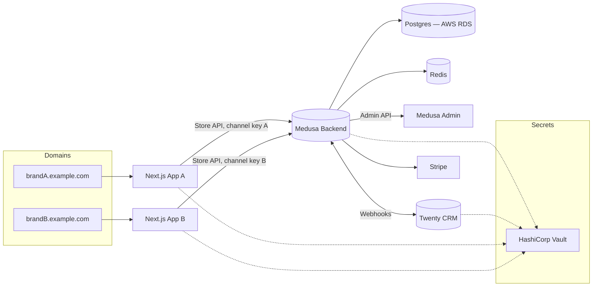

# 00 — Architecture Spec

## Purpose
Define the system boundaries, service topology, and data-flow contracts between Medusa,
Twenty CRM, and the two storefronts. This is the spec every other document traces back to.

## System topology

## Components

| Component | Responsibility | Notes |
|---|---|---|
| Medusa backend | Single instance, source of truth for catalog, cart, orders, payments, inventory, customers | Two sales channels: `brand-a`, `brand-b` |
| Next.js App A / B | Storefront UI per brand | Independent deploys, same Medusa backend, different publishable API key per channel |
| Medusa Admin | Order/catalog management for staff | One Admin, filtered views by sales channel |
| Twenty CRM | Customer contact record + shipping/fulfillment workflow | Owns shipping end-to-end; writes back only fulfillment/tracking |
| Stripe | Payment processing, JPY + USD | Standard Medusa Stripe plugin |
| Redis | Event/webhook retry queue, cache | Backs the sync-resilience process |
| Vault | Secret storage for all API keys/tokens | Reused from prior project |

## Key architectural decisions

1. **One Medusa backend, two sales channels** — not two instances. Shared customers,
   shared inventory, and one Admin all come for free this way; brand separation happens at
   the sales-channel and API-key level, not at the infrastructure level.
2. **Shared inventory pool** — inventory items are not duplicated per channel. Both
   storefronts read/write the same stock.
3. **Medusa is the order-state source of truth.** Twenty can update fulfillment/tracking
   fields but never order totals, payment status, or order status directly — that keeps a
   single reliable place to answer "what happened to this order."
4. **Two separate frontends**, not one shared app — independent branding, independent
   deploys, independent domains, same backend underneath.
5. **Async, resilient sync** — Medusa never blocks a sale on Twenty's availability. All
   Medusa → Twenty calls are fire-and-forget with a retry queue behind them.

## Data flow contracts (summary — full schemas in 10-api-spec.md)

| Flow | Direction | Trigger | Payload essentials |
|---|---|---|---|
| Order placed | Medusa → Twenty | `order.placed` event | order id, customer email/name, line items, shipping address |
| Customer upsert | Medusa → Twenty | same event, deduped by email | customer email, name, brand tag |
| Fulfillment update | Twenty → Medusa | staff marks shipped/tracking entered | order id, tracking number, carrier, fulfillment status |

## Open questions carried forward
None outstanding — all resolved in the process-landscape and scope docs. This spec will be
revisited if brand-specific infra (e.g., separate CDN per brand) becomes necessary.

## Done means
- [ ] Docker Compose brings up Medusa, local Postgres (dev only — prod uses AWS RDS per `12-database-design.md`), Redis, Twenty, both frontends locally
- [ ] Two sales channels exist in Medusa with distinct publishable keys
- [ ] Vault holds all secrets referenced above; no secret is hardcoded or in `.env` committed to git
- [ ] Webhook endpoints (both directions) are reachable between Medusa and Twenty in the local/dev stack
