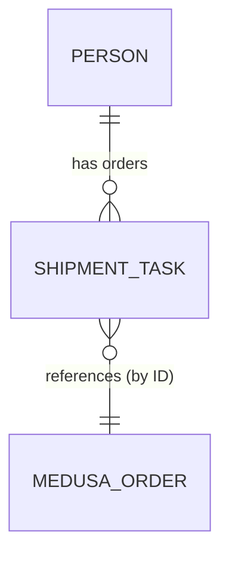

# 07 — Twenty CRM Data Model Spec

## Purpose
Define the Twenty-side object model that supports the unified customer contact and the
shipping/fulfillment workflow Twenty owns.

## Objects

### Person (standard Twenty object)
| Field | Source | Notes |
|---|---|---|
| Email | Medusa customer email | Dedupe key — one Person per email, regardless of brand |
| Name | Medusa customer name | |
| Brands purchased from | Custom multi-select field (`Brand A`, `Brand B`) | Populated/updated on each order sync |
| Linked orders | Relation to Shipment/Task records below | One Person → many orders across both brands |

### Shipment/Fulfillment Task (custom object)
| Field | Source | Notes |
|---|---|---|
| Medusa order ID | Order payload | Primary link back to Medusa; used for idempotency |
| Sales channel | Order payload | `brand-a` or `brand-b`, for staff filtering |
| Shipping address | Order payload | Editable by staff if corrections needed |
| Shipping method | Set by staff | |
| Shipping cost | Set by staff | |
| Fulfillment status | Set by staff | `new` → `processing` → `shipped` → `delivered` |
| Tracking number | Set by staff | Triggers inbound webhook to Medusa when filled |
| Linked Person | Relation | Resolved via order's customer email |

## Relations

- Person ↔ Shipment/Task: one-to-many, spans both brands
- Shipment/Task ↔ Medusa order: one-to-one, linked by Medusa order ID (Twenty does not
  duplicate order line items — it stores just enough to fulfill, and always treats Medusa
  as the source of truth for what was actually purchased)

## Sync behavior (mechanics detailed in `08-integration-webhooks.md`)
- Person is upserted, never duplicated, on each incoming order — matched by email
- Shipment/Task is created once per Medusa order (idempotent on order ID)
- Only `fulfillment status` and `tracking number` fields flow back to Medusa; all other
  fields are Twenty-local and not synced back

## Open questions
**How Twenty actually ingests the outbound payload is still open, and matters for
setup below.** This repo's Medusa side (see "Implementation status" below) POSTs a
plain signed JSON webhook per `08-integration-webhooks.md`'s payload shape,
addressed to whatever URL `TWENTY_WEBHOOK_URL` names. Twenty itself doesn't ship a
generic "POST arbitrary JSON here, upsert a Person and a custom object from it"
endpoint out of the box — the receiving side has to be built inside Twenty using
whatever mechanism its current version offers for turning an inbound HTTP call into
record writes (a webhook-triggered Workflow with upsert actions, if the target
Twenty version has one, is the most likely fit; the alternative is skipping
webhook ingestion entirely and having a sync process call Twenty's own GraphQL/REST
API directly with `TWENTY_API_TOKEN` instead). This could not be verified against a
real Twenty instance in this repo's environment (no Docker daemon available to run
one — see `19-milestones.md`), so treat it as the first thing to confirm against
Twenty's current docs before wiring the two systems together for real.

## Implementation status
The Medusa side of this contract is built and tested (`apps/backend/src/
subscribers/twenty-order-sync.ts`, `apps/backend/src/modules/twenty-sync/`,
`apps/backend/integration-tests/http/twenty-webhooks.spec.ts`) — see
`19-milestones.md` Phase 5 for what's verified. **The Twenty-side object model
described above is not something this repo can create for you** — Person's custom
field and the Shipment/Task custom object are configured by hand inside a running
Twenty workspace (self-hosted via the `twenty` Docker Compose profile, or Twenty
Cloud), using Twenty's own no-code object/field builder in Settings → Data model.
Set up, once you have a workspace:

1. **Person → add a custom field** "Brands purchased from": a multi-select field
   with options `Brand A` and `Brand B`. Nothing else needs adding to Person —
   email/name are already standard fields.
2. **Create a custom object** "Shipment/Fulfillment Task" with these fields, all
   matching the table earlier in this doc:
   - `Medusa order ID` (text) — set from the inbound payload's `order.id`; treat as
     the idempotency key when checking whether a Task already exists for an order.
   - `Sales channel` (text or select) — from `order.sales_channel`.
   - `Shipping address` (text or address field) — from `order.shipping_address`.
   - `Shipping method`, `Shipping cost` (text/number) — staff-entered, not synced in.
   - `Fulfillment status` (select: `new`, `processing`, `shipped`, `delivered`).
   - `Tracking number` (text).
   - `Linked Person` (relation to Person).
3. Whatever mechanism ends up receiving the outbound webhook (see "Open questions"
   above) needs to, on each call: look up or create a Person by `order.customer.email`
   with the `Brands purchased from` field including `order.sales_channel`; look up or
   create a Task by `Medusa order ID` (never create a second one for the same id);
   link the Task to the Person.
4. Configure Twenty to call `POST {this backend's URL}/webhooks/twenty/fulfillment`
   (signed per `08-integration-webhooks.md`'s Auth section, using the same secret as
   this repo's `TWENTY_INBOUND_WEBHOOK_SECRET`) whenever a Task's `Fulfillment status`
   or `Tracking number` field changes — again, the exact mechanism (an automation/
   workflow on field change, if available) depends on the Twenty version in use.

## Done means
- [ ] Creating two orders from the same email (one per brand) results in exactly one
      Person record with both orders linked
- [ ] Each Medusa order produces exactly one Shipment/Task record, even under webhook
      redelivery
- [ ] Only fulfillment status + tracking number changes propagate back to Medusa; edits to
      any other Task field do not trigger an outbound sync

None of the three above can be checked off from this repo alone — they describe
behavior inside a running Twenty workspace, which this environment cannot run (see
"Implementation status"). The Medusa-side equivalents actually verified here are
listed in `19-milestones.md` Phase 5: the outbound payload's shape and delivery
guarantees, and the inbound route's signature/allowlist/idempotency behavior.
