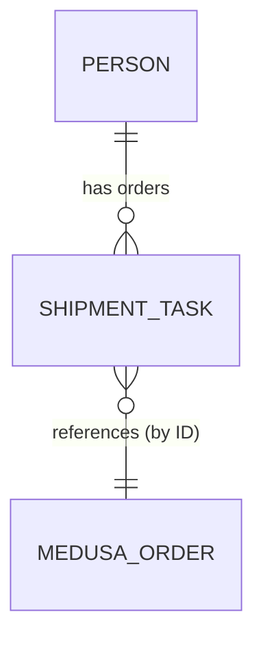

# 07 — Twenty CRM Data Model Spec

## Purpose
Define the Twenty-side object model that supports the unified customer contact and the
shipping/fulfillment workflow Twenty owns.

## Objects

### Person (standard Twenty object)
| Field | Source | Notes |
|---|---|---|
| Email | Medusa customer email | Dedupe key — one Person per email, regardless of brand |
| Name | Medusa customer name | |
| Brands purchased from | Custom multi-select field (`Brand A`, `Brand B`) | Populated/updated on each order sync |
| Linked orders | Relation to Shipment/Task records below | One Person → many orders across both brands |

### Shipment/Fulfillment Task (custom object)
| Field | Source | Notes |
|---|---|---|
| Medusa order ID | Order payload | Primary link back to Medusa; used for idempotency |
| Sales channel | Order payload | `brand-a` or `brand-b`, for staff filtering |
| Shipping address | Order payload | Editable by staff if corrections needed |
| Shipping method | Set by staff | |
| Shipping cost | Set by staff | |
| Fulfillment status | Set by staff | `new` → `processing` → `shipped` → `delivered` |
| Tracking number | Set by staff | Triggers inbound webhook to Medusa when filled |
| Linked Person | Relation | Resolved via order's customer email |

## Relations

- Person ↔ Shipment/Task: one-to-many, spans both brands
- Shipment/Task ↔ Medusa order: one-to-one, linked by Medusa order ID (Twenty does not
  duplicate order line items — it stores just enough to fulfill, and always treats Medusa
  as the source of truth for what was actually purchased)

## Sync behavior (mechanics detailed in `08-integration-webhooks.md`)
- Person is upserted, never duplicated, on each incoming order — matched by email
- Shipment/Task is created once per Medusa order (idempotent on order ID)
- Only `fulfillment status` and `tracking number` fields flow back to Medusa; all other
  fields are Twenty-local and not synced back

## Open questions
None — this model directly implements the write-back scope guard defined in
`00-architecture.md` and the functional requirements master list (item C5).

## Done means
- [ ] Creating two orders from the same email (one per brand) results in exactly one
      Person record with both orders linked
- [ ] Each Medusa order produces exactly one Shipment/Task record, even under webhook
      redelivery
- [ ] Only fulfillment status + tracking number changes propagate back to Medusa; edits to
      any other Task field do not trigger an outbound sync
