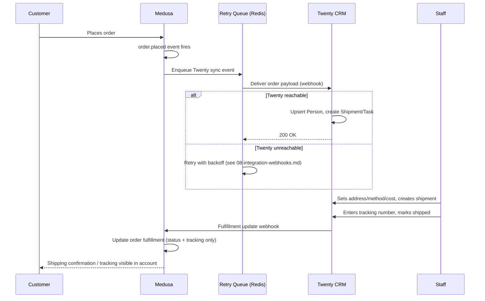

# 09 — Shipping Workflow Spec

## Purpose
Define the full order → ship → fulfilled sequence, owned end-to-end by Twenty, and the
state machine that governs it.

## Sequence



## State machine (Shipment/Task, in Twenty)

```
new → processing → shipped → delivered
                 ↘ exception (address issue, damaged, etc.)
```

- **new**: Task created from `order.placed`, no staff action yet
- **processing**: staff has claimed the task, is preparing shipment
- **shipped**: tracking number entered, triggers inbound webhook to Medusa
- **delivered**: carrier confirms delivery (manual staff update or carrier webhook if
  integrated later — out of scope for this pass, staff sets manually for now)
- **exception**: address problem, damaged item, etc. — held for manual resolution, does
  not sync a fulfillment update to Medusa until resolved

## What Medusa reflects vs. what stays Twenty-only

| Data | Where it lives | Synced to Medusa? |
|---|---|---|
| Shipping address | Twenty (copied from order at creation) | No — Medusa's original order address is unchanged even if Twenty corrects it locally |
| Shipping method/cost | Twenty | No |
| Fulfillment status | Twenty | **Yes** — `shipped`/`delivered` sync to Medusa's fulfillment record |
| Tracking number | Twenty | **Yes** |
| `processing`/`exception` states | Twenty | No — these are staff-facing only, Medusa order stays "awaiting fulfillment" until `shipped` |

This asymmetry is intentional: Medusa customers/Admin need to know *whether and how* an
order shipped, not the internal staff workflow that got it there.

## Failure modes

| Scenario | Behavior |
|---|---|
| Twenty down when order placed | Order completes normally; Task creation retried per `08-integration-webhooks.md` |
| Medusa down when staff marks shipped | Twenty holds the update; staff can re-save or Twenty's own retry delivers once Medusa is back |
| Staff enters an invalid tracking format | Twenty-side validation (not Medusa's concern) — Medusa receives whatever string is sent |
| Duplicate `order.placed` delivery | Idempotency key prevents a second Task from being created |

## Open questions
- Confirm whether "delivered" needs a carrier-webhook integration later, or manual staff
  confirmation is acceptable long-term (assumed manual for this pass)

## Done means
- [ ] A test order visibly moves through `new → processing → shipped` in Twenty and shows
      "shipped" + tracking in the Medusa Admin and customer account
- [ ] An `exception` task does not falsely mark the Medusa order as fulfilled
- [ ] Sequence holds correctly under a simulated Twenty outage at order-placement time
