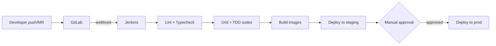

# 15 — CI/CD Spec

## Purpose
Define the build/test/deploy pipeline using self-hosted GitLab (source + CI trigger) and
Jenkins (pipeline execution), consistent with the portfolio-scoped infra decisions in
`13-infra-docker-compose.md`.

## Toolchain

- **GitLab (self-hosted)**: source control, merge requests, branch protection
- **Jenkins (self-hosted)**: pipeline execution — triggered by GitLab webhooks on push/MR
- **Vault (self-hosted)**: secret injection into Jenkins pipeline steps, per
  `14-env-secrets.md`

## Trigger model



- GitLab webhook fires a Jenkins job on every push to a merge request and on merge to
  `main`
- Merge to `main` runs the full pipeline through staging deploy automatically; prod
  deploy requires a manual approval step in Jenkins (portfolio-scoped: no automatic
  prod deploy)

## Pipeline stages

| Stage | What runs | Gate |
|---|---|---|
| Lint + typecheck | ESLint/TSC across Medusa customizations, both Next.js apps | Must pass to proceed |
| Unit + TDD suites | All specs under `docs/tdd/` — see `16-testing-strategy` (next spec) | Must pass to proceed |
| Build images | Docker images for Medusa, App A, App B (Twenty only if self-hosted and modified) | Must build cleanly |
| Deploy staging | Jenkins pulls secrets from Vault, deploys to staging environment, runs against staging RDS | Auto on merge to `main` |
| Manual approval | A person clicks "promote to prod" in Jenkins | Required, no auto-promote |
| Deploy prod | Same deploy job, pointed at prod config/secrets | Only after approval |

## Jenkinsfile shape (declarative, illustrative)

```groovy
pipeline {
  agent any
  stages {
    stage('Lint') { steps { sh 'npm run lint' } }
    stage('Test') { steps { sh 'npm run test' } }
    stage('Build') { steps { sh 'docker build -t medusa:$BUILD_ID ./medusa' } }
    stage('Deploy Staging') {
      when { branch 'main' }
      steps {
        withVault(configuration: [vaultUrl: env.VAULT_ADDR], vaultSecrets: [...]) {
          sh './deploy.sh staging'
        }
      }
    }
    stage('Approve Prod') {
      when { branch 'main' }
      steps { input message: 'Promote to production?' }
    }
    stage('Deploy Prod') {
      when { branch 'main' }
      steps {
        withVault(configuration: [vaultUrl: env.VAULT_ADDR], vaultSecrets: [...]) {
          sh './deploy.sh prod'
        }
      }
    }
  }
}
```

## Environments

- **Staging**: mirrors prod topology at smaller scale, points at a separate staging RDS
  instance (not the prod database), used for pre-release verification and manual QA
- **Prod**: portfolio-scoped, single environment, no blue-green — a short deploy window
  is acceptable per the project-type decision in the implementation plan

## Open questions
- Confirm Jenkins agent setup (static agent vs. containerized/dynamic agents) — doesn't
  change this spec's contract, just the underlying Jenkins infra
- Confirm whether GitLab CI's own `.gitlab-ci.yml` is used at all, or GitLab is purely
  source+webhook-trigger with Jenkins doing 100% of pipeline execution (assumed the
  latter above)

## Done means
- [ ] A push to a merge request in GitLab triggers lint+test in Jenkins automatically
- [ ] Merge to `main` deploys to staging without manual steps
- [ ] Prod deploy requires an explicit manual approval and cannot happen accidentally
- [ ] Jenkins never has a secret hardcoded in the Jenkinsfile — everything comes from
      Vault at run time
